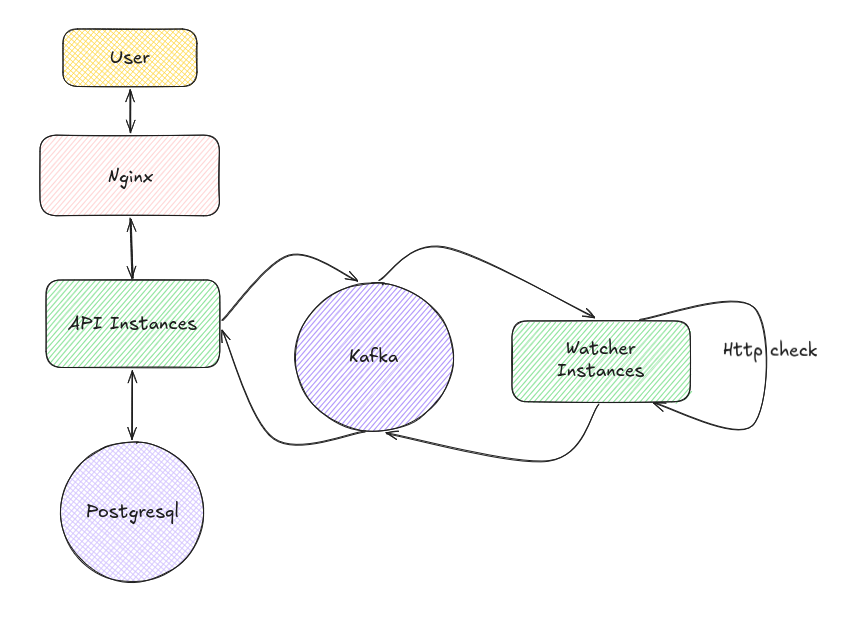
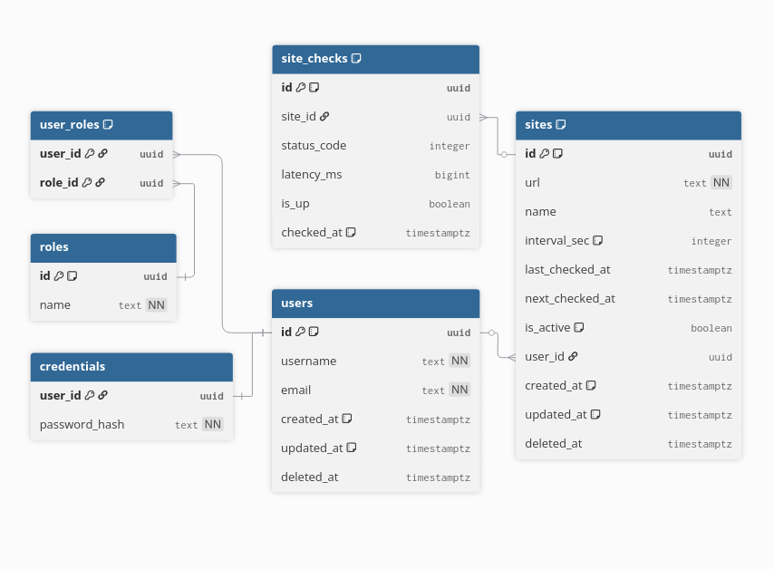

## Uptime Checker

Система мониторинга доступности веб-ресурсов

### Описание сервисов

Watcher: Принимает таски для опроса сайтов по кафке и отправляет результаты в API.
Реализована фича с переменным количеством горутинов в зависимости от нагрузки процессора

API: Центральный узел, который принимает результаты от воркеров, обрабатывает и сохраняет историю проверок.

### Технологический стек

- Язык: Golang
- Сборка: Docker (Multi-stage builds)
- Оркестрация: Docker Compose, Nginx
- Взаимодействие: Kafka
- БД: PostgreSQL + GORM + Goose
- Gin

### Интересные фичи
- Динамическое управление пулом горутин на основе загруженности процессора
- Nginx как Load Balancer
- Горизонтальное масштабирование сервисов

### Архитектура

Load Balancing: На входе стоит Nginx, который распределяет трафик между инстансами API.

Network Isolation:
- **app-network**: Публичный для Nginx и API.
- **back-network**: Изолированный внутренний  для API, Watcher, Kafka и PostgreSQL. Прямой доступ извне к БД и брокеру закрыт.

Взаимодействие через Kafka:
- site.check.task — задачи от API к воркерам.
- site.check.result — ответы от Watcher обратно в API.

### Схема БД

